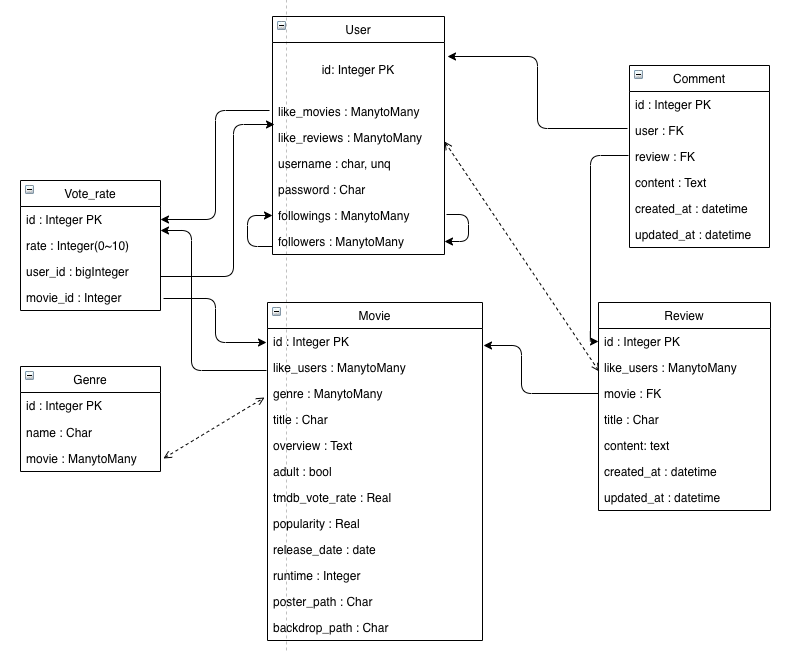

# PJT final

:clapper: 목차

> 박소미 - Front-end
>
> > 단계별 구현 과정 & 어려웠던 부분
>
> 이준형 - Back-end
>
> > 단계별 구현 과정 & 어려웠던 부분
>
> 배운 것 & 느낀 점

*****************

## 

## 1. 팀원 정보 및 업무 분담 내역

박소미 - SSAFY 이전 개발 경력 없음

이준형 - SSAFY 이전 개발 경력 없음

Django Rest Framework와 Vue.js를 활용하여 서버와 클라이언트로 파트를 나누어 진행했다. 

박소미 교육생이 Vue.js를 활용한 클라이언트를, 이준형 교육생이 DRF를 활용한 api 서버를 담당했다.

## 2. 목표 서비스 구현 및 실제 구현 정도 - 각자

| 목표 서비스                                                  | 실제 구현 정도 | 비고 |
| ------------------------------------------------------------ | -------------- | ---- |
| Tmdb api 서버를 통한 영화, 장르 데이터 수집하여 db에 저장    | 완료           |      |
| 전체 모델 구조 및 Url 구조 설계                              | 완료           |      |
| DRF에 있는 영화 데이터를 클라이언트에서 불러오기             | 완료           |      |
| 영화와 1:N 관계를 갖는 리뷰 CRUD 기능                        | 완료           |      |
| jwt를 활용한 account 기능                                    | 완료           |      |
| 리뷰 '좋아요'(User와 M:N관계), 댓글(리뷰, User와 1:N관계) CRUD 기능 | 완료           |      |
| 영화, 리뷰, 댓글 통합 검색 기능                              | 완료           |      |
| User간 follow 기능                                           | 완료           |      |
| 영화 평점 기능(중개테이블을 활용한 M:N 관계)                 | 완료           |      |
| 유저의 영화 평점 정보를 활용한 장르 추천                     | 완료           |      |
| 다양한 기준의 영화 추천                                      | 완료           |      |

## 3. 데이터베이스 모델링(ERD)

- 중개용이 아닌 실질적인 테이블은 `User`, `Movie`, `Genre` `Review`,`Comment` 가 있다. `Vote_rate`같은 경우는 모델로 코드상 구현은 했지만 `Movie`와 `User`를 연결짓기 위한 중개 테이블이다.
- 모든 테이블은 하나 이상의 테이블과 연결 관계를 가진다.

## 4. 필수 기능에 대한 설명

### 백엔드

##### 1. TMDB의 API를 활용하여 영화와 장르의 정보 가져오기

- 영화에 대한 요청을 보내고 그 데이터를 저장하는 과정은, view의 함수 내의 내부함수로 만들어서, 여러 url(`popular`, `top_rated`, `upcoming` 등)에서 영화 데이터를 가져왔다. 
- `requests`를 통해 tmdb api 서버에 요청을 보냈다. 이때 api키를 숨기기 위해 `secrets.json`이라는 `git`에 등록되지 않는 파일을 하나 만들어 저장한 후, 그 파일을 `view.py`에서 불러와 사용했다.
- tmdb api 서버에서 사용하는 `movie`의 키값을 쟝고에서는 다르게 저장하고(ex: `vote_average` => `tmdb_vote_average` ), `genre_ids`를 그대로 활용하는게 아니라 `Genre`모델과 연결짓고 싶었고, 동시에 이미 db에 존재하는 영화의 정보는 새로 저장하지 않고 db의 인스턴스를 지정하여 저장하고 싶었는데, 이를 한 번에 처리하는 방법을 몰라서, 응답받은 json을 통채로 시리얼라이저에 `many=True`로 넣지 않고 각 영화를 하나 하나 조건에 맞게 시리얼라이저를 통해 저장하도록 했다. 이 과정이 몇 백번을 반복하다 보니 생각보다 오래 걸리는 듯 했는데, 이를 단축시킬 수 있는 방법이 있는지 궁금하다.

##### 2. 평점 등록

- 유저와 영화의 M:N 관계인데, 평점을 1점에서 10점 사이의 숫자로 함께 저장해야 했기 때문에 `vote_rate`라는 중개테이블을 만들어 활용했다.
- 사실 필요에 의해 어쩔 수 없이 중개테이블을 만들어 사용했는데, 그 덕에 db의 내용을 가져올 때 `vote_rate`라는 이름으로 여러가지 기능들을 활용할 수 있어 편리했다.

##### 3. 장르

- 각각의 장르를 통해 관련된 영화들을 찾아보고 싶었고, 하나의 영화가 여러개의 장르를 포함하는 경우도 많았으므로 장르 테이블을 영화와 M:N 관계를 가지도록 구성하였다. 

##### 4. 리뷰

- 리뷰는 영화, 작성 유저와 1:N 관계를 가지게 구성했다. 또한 좋아요 기능을 구현했으므로 좋아요를 누른 유저와 M:N 관계를 구성했다.
-  리뷰의 댓글은 작성된 리뷰, 작성한 유저와 1:N 관계를 가진다.

##### 5. 유저(어카운트)

- 쟝고의 기본 유저를 활용하되, 인증 방식은 `drf jwt` 을 통해 토큰 인증방식으로 구성했다. 
- 회원가입 과정에서 검사 (`password_confirmation`과 일치 확인 등)을 프론트에서도 하고 있지만, 누군가 클라이언트를 조작해 잘못된 요청을 보내더라도 백에서 막을 수 있도록 했다.
- 유저 간 팔로우 기능을 구현하였는데, 이를 활용한 다채로운 기능은 구현하지 못했다.

##### 6. 검색

- 클라이언트 화면 nav bar의 검색창을 통해서 영화, 리뷰, 댓글을 검색할 수 있도록 구성했다.
- 영화의 제목과 줄거리, 리뷰의 제목과 내용을 동시에 검색하고 싶어 쟝고 orm의 `Q`를 활용하여 필터로 데이터를 찾았다.

##### 7. 영화 추천 알고리즘

- 기본적으로 인기순, 평점순, 개봉일자순 등을 제공했다.
- 로그인된 사용자의 경우, 그 유저가 메긴 영화 평점을 기반으로 각각의 장르에 대한 점수를 메겨 선호 장르들의 영화 중 평점을 주지 않은 영화들을 인기순으로 추천하였다.
- 때문의 각각의 유저의 선호 장르를 알려주는 응답과, 그 장르에 대한 요청을 보냈을 때 장르에 해당하는 영화들 중 해당 사용자의 평점이 없는 영화들을 보내주는 응답, 두 가지의 응답으로 구성했다.
- 선호 장르에 대한 응답에서는 각각의 장르에 대한 총 점수와, 그를 기반으로 람다식으로 정렬한 리스트를 가진 `rank`라는 밸류를 넣어 응답하였다.

## 5. 느낀 점

- 사실 전체적인 erm구조를 초기 단계에서 간략하게만 잡은 뒤, 코딩을 하면서 필요한 테이블을 추가하고 수정하는 방식으로 진행했는데, 이 때문에 db를 갈아엎는 작업을 여러번 수행했다. 이 정도 규모의 프로젝트에서는 큰 문제가 없었지만, 프로젝트 규모가 커진다면 큰 불편함, 리스크가 따를 수 있으니 구현을 시작하기 전에 구조를 잡고 가는 습관을 들여야겠다.
- 항상 느꼈듯, 협업을 할 때는 계속해서 의사소통을 하고, 특히 동료의 파트와 연관되는 부분을 건드릴 때는 작은 변경사항도 바로 알려야 불필요한 시간 낭비를 줄일 수 있음을 느꼈다. 특히 이번처럼 서버와 클라이언트로 파트가 나뉘었을 때는, 서버에서의 작은 변화가 클라이언트를 구성하는데 큰 불편을 끼칠 수도 있다는 생각이 들었다.
- 실제로 설계부터 구현까지 생각해가며 진행한 프로젝트는 처음이었는데, 생각보다도 더 신경 써야할 부분이 많고, 정해진 시간 안에 구상한 것들을 구현해야 한다는 점이 스트레스임과 동시에 굉장히 재미있었다. 하지만 후반부로 갈 수록 지치는 느낌이 들었는데, 체력과 함께 지치지 않도록 적절한 페이스를 유지하는 능력도 길러야겠다.
